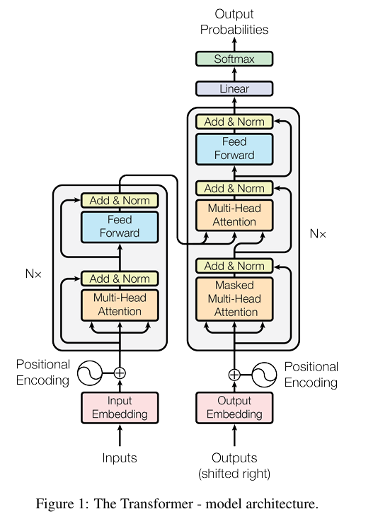

> Code for The Annotated Transformer blog post:
>
> http://nlp.seas.harvard.edu/annotated-transformer/
>
> 
>
> 
>
> 

# Transformer与代码实现

## 原理

> 1. 每个注意力输入的 3 个箭头，从右到左依次是Q、K、V
> 2. Encoder  输出的对应代码中的 memory ，这个memory 在 N 个 Decoder 子结构中共享
> 3. Encoder  输入的是需要翻译的序列， Decoder 输入的是已经翻译过的序列部分

### 缩放点积注意力

$Attention$ 的本质是 $softmax(XX^T)X$ 。
$$
Attention(Q, K, V)=softmax(\frac{QK^T}{\sqrt{d_k}})V
$$
$d_k$ 是 $W^K$ 的维度（论文里是64）， $\frac1{\sqrt{d_k}}$ 本质 是用来做一个 scale （缩放），使点积的方差变为 1 。

### 多头注意力

$$
MultiHead(Q, K, V)=Concat(head_1, ..., head_h)W^O
$$

其中：
$$
head_i=Attention(QW_i^Q, KW_i^K, VW_i^V)
$$
这几个头的设定是在不同的子空间内，也就是把 $d_k$ 分为 $h$ 段，每段的关注点不同，以适应不同语境。

### 自注意力

最早的 Attention 是九几年在视觉领域提出的，火起来是2014年Google的 [Recurrent Models of Visual Attention](https://arxiv.org/pdf/1406.6247.pdf)，第一个将 Attention 用在 NLP 上的就是 Bahdanau 的 [Neural Machine Translation by Jointly Learning to Align and Translate](https://arxiv.org/pdf/1409.0473.pdf) ，这个工作主要是用 Attention进行翻译和对齐，下一次大火就是 Transformer 的 self-Attention 。

注意力机制的目标是缓解 **长依赖（ long-range dependencies）问题** 。

传统的 Attention 机制是在 seq2seq 任务中使用的，通常是算输出序列每个单位与输入序列每个单位的注意力权重（对齐），而 Self-Attention 是在 Source 内部或 Target 内部或二者合体计算的注意力权重，可以不要求输入输出都是序列。

>  举个栗子：
>
>  我买了一杯饮料，这杯饮料里有芋圆，我很喜欢它。
>
>  对于这个“它”，“饮料”的注意力就会更高。

### FFN

  接在每一层的 Attention 之后，由两个线性变换组成，中间是 ReLU 激活函数，可以视为两个大小为 1 的卷积核，就是用来增大模型复杂度的。
$$
FFN(x)=max(0,xW_1+b_1)W_2+b_2
$$

### Layer Normalization

目的是将数据标准化到 ReLU 激活函数的作用区域。
$$
LN(x_i)=\alpha\frac{x_i-\mu_i}{\sqrt{\sigma^2+\xi}}+\beta
$$

> 还有一种标准化是 Batch Normalization ，二者的区别在于 LN 是对每一个数据进行标准化，更适合用在 RNN 等时序模型中，而 BN 是对一个批量的数据的标准化。

### Positional Encoding

位于 embedding 后，block 之前，是 Transformer 的特有机制，直接叠加在 embedding 上。
$$
PE_{(pos,2i)}=sin(pos/10000^{2i/d_{model}})\\
PE_{(pos,2i+1)}=cos(pos/10000^{2i/d_{model}})
$$

> 不同于 RNN 的一步一步处理序列，Transformer 的工作方式是输入一整个序列、生成一整个序列，所以 **从根源上解决了长依赖（ long-range dependencies）问题** ，同时还赋予模型并行处理的能力，但这也意味着输入序列都是平等的，因此必须使用位置编码。

### Residual Learning

> 思想：理想的深度网络的表现应该不比浅层网络差，深层网络内部的小区块可以实。现 **恒等映射** ，也就是输入输出相同，实现上把模块的输入加在输出上再去激活函数就可以了

在 transformer 中，我们知道它的 decoder 和 encoder 都有 6 个 **Attention+FFN** 结构，操作方法是 **Residual (Atten) --> Norm --> Residual (FFN) --> Norm** 。

## 实现细节

### 参数初始化

`Glorot / fan_avg` ：对每一层的输入 f_i 和输出 f_o ，该层的范围是 $[-\sqrt{6 / (f_i + f_o)}, \sqrt{6 / (f_i + f_o)}]$

### 学习率调整

$$
lr=d^{−0.5}_{model}\cdot min(step\_num^{−0.5},step\_num\cdot warmup\_steps^{−1.5})
$$

## 小结

# 参考

[注意力机制研究现状综述（Attention mechanism） - 知乎 (zhihu.com)](https://zhuanlan.zhihu.com/p/361893386)

[一文看懂 Attention（本质原理+3大优点+5大类型） - 知乎 (zhihu.com)](https://zhuanlan.zhihu.com/p/91839581)